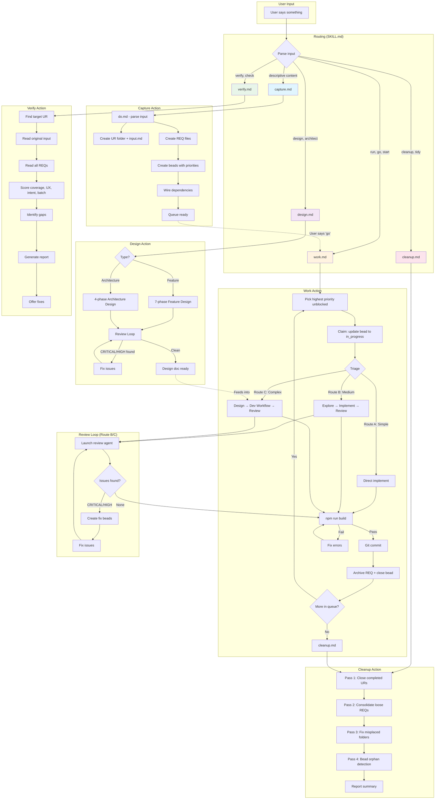
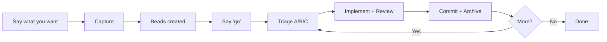
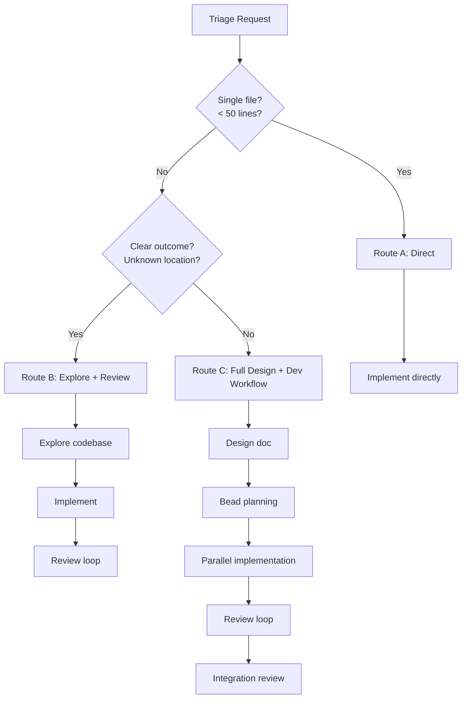
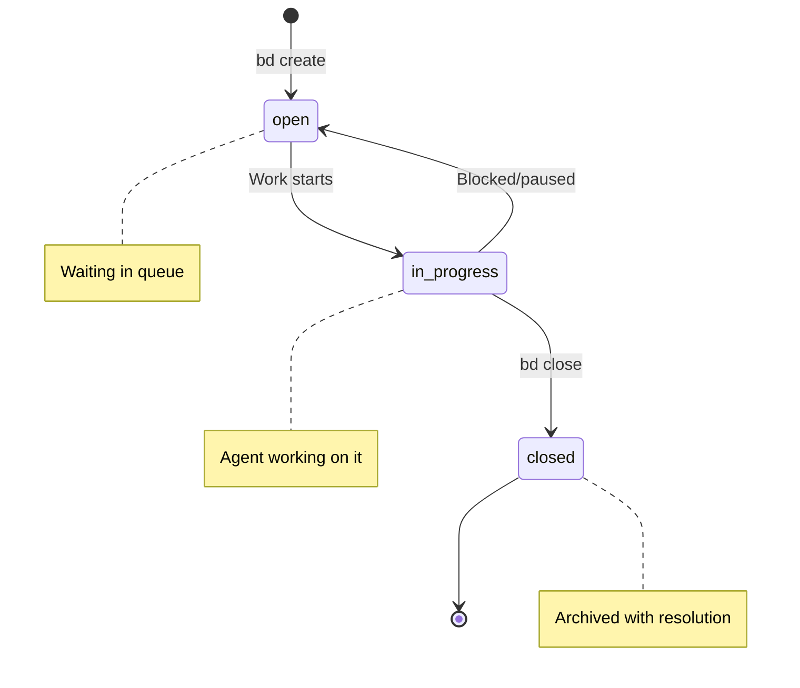

# Do-Work Workflow Diagram

```mermaid
flowchart TB
    subgraph Input["User Input"]
        U[User says something]
    end

    subgraph Routing["Routing (SKILL.md)"]
        R{Parse input}
        R -->|"descriptive content"| CAPTURE
        R -->|"run, go, start"| WORK
        R -->|"design, architect"| DESIGN
        R -->|"verify, check"| VERIFY
        R -->|"cleanup, tidy"| CLEANUP
    end

    subgraph Capture["Capture Action"]
        CAPTURE[capture.md]
        CAPTURE --> DO[do.md - parse input]
        DO --> UR[Create UR folder + input.md]
        DO --> REQ[Create REQ files]
        REQ --> BEADS[Create beads with priorities]
        BEADS --> DEPS[Wire dependencies]
        DEPS --> QUEUE[Queue ready]
    end

    subgraph Design["Design Action"]
        DESIGN[design.md]
        DESIGN --> DTYPE{Type?}
        DTYPE -->|"Feature"| FEAT[7-phase Feature Design]
        DTYPE -->|"Architecture"| ARCH[4-phase Architecture Design]
        FEAT --> REVIEW1[Review Loop]
        ARCH --> REVIEW1
        REVIEW1 -->|"CRITICAL/HIGH found"| FIX1[Fix issues]
        FIX1 --> REVIEW1
        REVIEW1 -->|"Clean"| DOUT[Design doc ready]
    end

    subgraph Work["Work Action"]
        WORK[work.md]
        WORK --> PICK[Pick highest priority unblocked]
        PICK --> CLAIM[Claim: update bead to in_progress]
        CLAIM --> TRIAGE{Triage}

        TRIAGE -->|"Route A: Simple"| RA[Direct implement]
        TRIAGE -->|"Route B: Medium"| RB[Explore → Implement → Review]
        TRIAGE -->|"Route C: Complex"| RC[Design → Dev Workflow → Review]

        RA --> BUILD[npm run build]
        RB --> BUILD
        RC --> BUILD

        BUILD -->|"Pass"| COMMIT[Git commit]
        BUILD -->|"Fail"| FIXBUILD[Fix errors]
        FIXBUILD --> BUILD

        COMMIT --> ARCHIVE[Archive REQ + close bead]
        ARCHIVE --> MORE{More in queue?}
        MORE -->|"Yes"| PICK
        MORE -->|"No"| CLEANUP2[Run cleanup]
    end

    subgraph Verify["Verify Action"]
        VERIFY[verify.md]
        VERIFY --> FINDUR[Find target UR]
        FINDUR --> READINPUT[Read original input]
        READINPUT --> READREQS[Read all REQs]
        READREQS --> SCORE[Score coverage, UX, intent, batch]
        SCORE --> GAPS[Identify gaps]
        GAPS --> REPORT[Generate report]
        REPORT --> OFFER[Offer fixes]
    end

    subgraph Cleanup["Cleanup Action"]
        CLEANUP[cleanup.md]
        CLEANUP2[cleanup.md]
        CLEANUP --> PASS1[Pass 1: Close completed URs]
        CLEANUP2 --> PASS1
        PASS1 --> PASS2[Pass 2: Consolidate loose REQs]
        PASS2 --> PASS3[Pass 3: Fix misplaced folders]
        PASS3 --> PASS4[Pass 4: Bead orphan detection]
        PASS4 --> CLEANREPORT[Report summary]
    end

    subgraph ReviewLoop["Review Loop (Route B/C)"]
        RB --> REVIEWAGENT[Launch review agent]
        RC --> REVIEWAGENT
        REVIEWAGENT --> CLASSIFY{Issues found?}
        CLASSIFY -->|"CRITICAL/HIGH"| CREATEFIX[Create fix beads]
        CREATEFIX --> FIXISSUE[Fix issues]
        FIXISSUE --> REVIEWAGENT
        CLASSIFY -->|"None"| BUILD
    end

    U --> R
    QUEUE -.->|"User says 'go'"| WORK
    DOUT -.->|"Feeds into"| RC

    style CAPTURE fill:#e1f5fe
    style WORK fill:#fff3e0
    style DESIGN fill:#f3e5f5
    style VERIFY fill:#e8f5e9
    style CLEANUP fill:#fce4ec
```

## Simplified Flow

```mermaid
flowchart LR
    A[Say what you want] --> B[Capture]
    B --> C[Beads created]
    C --> D["Say 'go'"]
    D --> E[Triage A/B/C]
    E --> F[Implement + Review]
    F --> G[Commit + Archive]
    G --> H{More?}
    H -->|Yes| E
    H -->|No| I[Done]
```

## Route Decision

```mermaid
flowchart TD
    T[Triage Request] --> Q1{Single file?<br>< 50 lines?}
    Q1 -->|Yes| A[Route A: Direct]
    Q1 -->|No| Q2{Clear outcome?<br>Unknown location?}
    Q2 -->|Yes| B[Route B: Explore + Review]
    Q2 -->|No| C[Route C: Full Design + Dev Workflow]

    A --> A1[Implement directly]
    B --> B1[Explore codebase]
    B1 --> B2[Implement]
    B2 --> B3[Review loop]
    C --> C1[Design doc]
    C1 --> C2[Bead planning]
    C2 --> C3[Parallel implementation]
    C3 --> C4[Review loop]
    C4 --> C5[Integration review]
```

## Bead Lifecycle

```mermaid
stateDiagram-v2
    [*] --> open: bd create
    open --> in_progress: Work starts
    in_progress --> open: Blocked/paused
    in_progress --> closed: bd close
    closed --> [*]

    note right of open: Waiting in queue
    note right of in_progress: Agent working on it
    note right of closed: Archived with resolution
```
