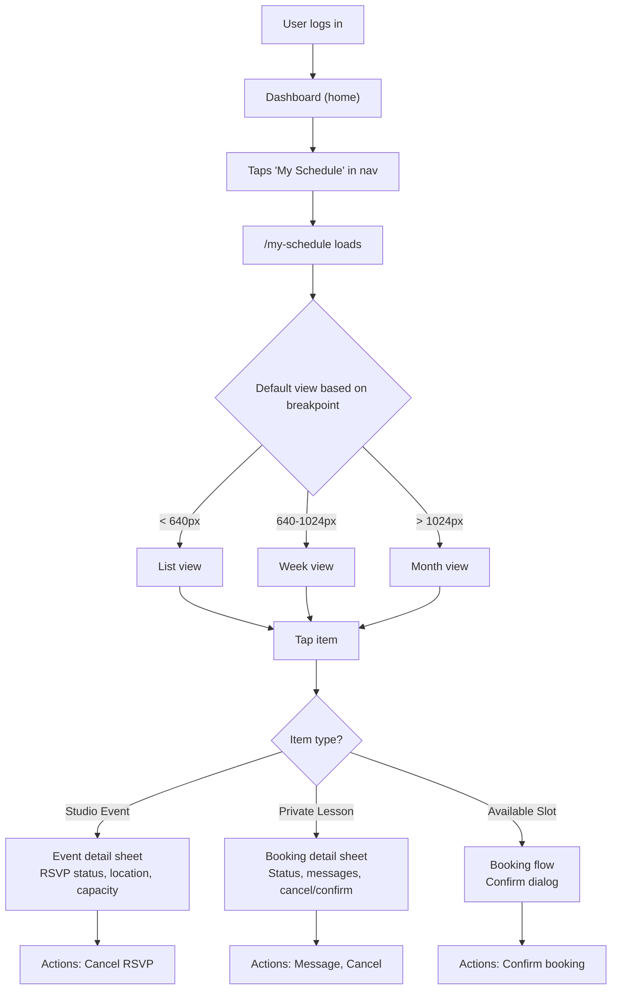
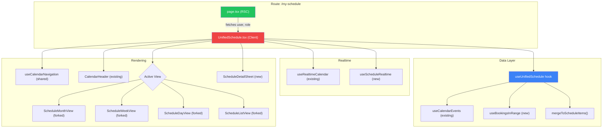

# Phase A: Unified Schedule View — Feature Design

**Status:** Design complete — review loop (5 rounds, 24+ issues) + phase gate PASSED
**PRD:** `docs/specs/unified-experience-prd.md` (Section 5)
**Bead:** app-vjv.1
**Created:** 2026-02-10

---

## Phase 1: Discovery

### Who Is Affected

| Role | Pain Point | Impact |
|------|-----------|--------|
| **Student** | Navigates `/private-sessions` for lessons and `/calendar` for events — no single "my week" view | Missed lessons, forgotten RSVPs, mental overhead |
| **Instructor** | Checks dashboard for pending requests, calendar for events, private-sessions for teaching schedule | Context-switching wastes time between classes |
| **Owner** | No consolidated view of studio utilization | Can't spot gaps or conflicts across instructors |

### What Success Looks Like

- Authenticated users see one calendar with all their commitments
- Color-coded items distinguish private lessons from studio events at a glance
- Tapping any item opens details with contextual actions (message, cancel, RSVP)
- Instructor availability can be overlaid for booking directly from the schedule
- All four views (week/day/month/list) work on desktop and mobile

### Constraints

- Public calendar at `/calendar` stays unchanged for unauthenticated users
- Group classes remain on the public calendar (not pulled into unified view separately)
- No new database tables needed — aggregates existing `private_lesson_bookings` + `event_rsvps` + `events`
- **Type system note:** `CalendarEventType` in `src/types/calendar.ts` includes `'private_lesson'` with blue color. The unified schedule must NOT render bookings as `CalendarEvent` objects. Bookings are always `ScheduleItem` with `type: 'booking'` and indigo color. The `mergeToScheduleItems()` function must filter out any events with `event_type === 'private_lesson'` to avoid duplication, since those are already represented via the bookings query.
- Must reuse existing shadcn/ui components and Tailwind conventions
- Realtime updates within 3 seconds (existing Supabase Realtime infrastructure)

### What Exists to Reuse

**Full reuse (no changes needed):**
- `TimeGrid.tsx` — base grid for week/day views
- `EventBlock.tsx` — positioned event block in time views
- `EventChip.tsx` — compact event pill for month view
- `CurrentTimeIndicator.tsx` — red "now" line
- `CalendarLegend.tsx` — color key
- `CalendarHeader.tsx` — view switcher + date navigation
- All booking API routes (`/api/bookings/*`)
- All event API routes (`/api/events`)
- All availability API routes (`/api/availability/*`, `/api/slots/*`)
- `useCalendarEvents` hook (events fetching with SWR)
- `usePendingBookings` / `useUpcomingBookings` hooks (dashboard booking cards — distinct from new `useBookingsInRange`)
- `useCalendarRealtime` / `useRealtimeCalendar` hooks

**Forked from existing (new copies — originals stay untouched for `/calendar`):**
- `ScheduleMonthView.tsx` — forked from `MonthView.tsx`, accepts `ScheduleItem[]`
- `ScheduleWeekView.tsx` — forked from `WeekView.tsx`, accepts `ScheduleItem[]`
- `ScheduleDayView.tsx` — forked from `DayView.tsx`, accepts `ScheduleItem[]`
- `ScheduleListView.tsx` — forked from `ListView.tsx`, accepts `ScheduleItem[]`

> **Why fork, not modify:** The existing views are tightly coupled to `CalendarEvent` (prop types, color lookups, event handlers, child components). Modifying them would break the public `/calendar` route. Forking lets us evolve the unified schedule independently. A shared abstraction can be extracted later once both views stabilize.

**New components needed:**
- `UnifiedSchedule.tsx` — new orchestrator (extracts shared logic from CalendarShell via `useCalendarNavigation` hook)
- `ScheduleDetailSheet.tsx` — polymorphic detail sheet (event vs booking)
- `BookingBlock.tsx` — positioned booking block for week/day views (mirrors EventBlock)
- `BookingChip.tsx` — compact booking pill for month view (mirrors EventChip)
- `BookingListCard.tsx` — booking card for list view
- `AvailabilityOverlay.tsx` — shows bookable slots when browsing instructors

**New hooks needed:**
- `useUnifiedSchedule` — orchestrates data fetching + merging
- `useBookingsInRange(dateRange)` — SWR hook wrapping `GET /api/bookings?start=X&end=Y` with related data
- `useCalendarNavigation` — shared logic extracted from CalendarShell (view persistence, URL state, date navigation, responsive defaults)

---

## Phase 2: User Stories

### Must Have (P1)

- **US-1:** As a student, I can see all my upcoming lessons and RSVP'd events in one calendar so I can plan my week
- **US-2:** As an instructor, I can see my teaching schedule alongside studio events I'm involved in
- **US-3:** As any user, I can tap any calendar item to see details and manage my booking/RSVP. Booking items support messaging (opens existing thread); event items show RSVP management only (event messaging deferred to Phase B Communication Layer).
- **US-5:** As any user, I can switch between week/day/month/list views

### Should Have (P2)

- **US-4:** As a student, I can overlay an instructor's availability on my schedule to find a time to book
- **US-S1:** As any user, the calendar remembers my preferred view and last-viewed date across sessions
- **US-S2:** As any user, I can share a deep link to a specific date/view (URL state)

### Could Have (P3)

- **US-C1:** As a student, I can see a "This week" summary count (e.g., "2 lessons, 1 event") on the dashboard
- **US-C2:** As an instructor, I can tap an empty time slot to block it off or create availability

### Won't Have (This Phase)

- Owner master schedule (Phase E)
- Drag-and-drop rescheduling
- iCal export
- Google Calendar sync

---

## Phase 3: UI/UX Design

### 3.1 User Flow



### 3.2 View Layouts

**Week View (default desktop 640-1024px)**

```
┌─────────────────────────────────────────────────────┐
│  < Feb 10-16, 2026 >    [Month] [Week] [Day] [List] │
├───────┬───────┬───────┬───────┬───────┬───────┬──────┤
│       │ Mon   │ Tue   │ Wed   │ Thu   │ Fri   │ Sat  │
│ 10am  │       │ ██████│       │       │       │      │
│       │       │ Salsa │       │       │       │      │
│       │       │ Class │       │       │       │      │
│ 11am  │       │ (blue)│       │       │       │      │
│       │       │       │       │       │       │      │
│ 12pm  │       │       │       │ ██████│       │      │
│       │       │       │       │Lesson │       │      │
│       │       │       │       │w/Maria│       │      │
│ 1pm   │       │       │       │(indigo│       │      │
│       │       │       │       │confirm│       │      │
│ 2pm   │       │       │       │       │       │      │
└───────┴───────┴───────┴───────┴───────┴───────┴──────┘
```

**Month View (default desktop > 1024px)**

```
┌─────────────────────────────────────────────────────┐
│  < February 2026 >       [Month] [Week] [Day] [List] │
├───────┬───────┬───────┬───────┬───────┬───────┬──────┤
│ Sun   │ Mon   │ Tue   │ Wed   │ Thu   │ Fri   │ Sat  │
│       │       │       │       │       │       │  1   │
│       │       │       │       │       │       │      │
│  2    │  3    │  4    │  5    │  6    │  7    │  8   │
│       │       │ ● ●   │       │ ●     │       │      │
│       │       │(chips)│       │(chip) │       │      │
│  9    │ 10    │ 11    │ 12    │ 13    │ 14    │ 15   │
│       │       │ ● ●   │       │ ● ●   │       │      │
│       │       │       │       │+1 more│       │      │
└───────┴───────┴───────┴───────┴───────┴───────┴──────┘
         Legend: ● Blue=Event  ● Indigo=Lesson  ● Yellow=Pending
```

**List View (default mobile < 640px)**

```
┌─────────────────────────────┐
│  < February 2026 >  [views] │
├─────────────────────────────┤
│  TODAY — Tuesday, Feb 10    │
│ ┌─────────────────────────┐ │
│ │ 10:00 AM                │ │
│ │ Salsa Fundamentals      │ │
│ │ ● Class · Studio A      │ │
│ │ 8/15 spots              │ │
│ └─────────────────────────┘ │
│                             │
│  THURSDAY, Feb 12           │
│ ┌─────────────────────────┐ │
│ │ 12:00 PM                │ │
│ │ Private Lesson           │ │
│ │ ● Confirmed · w/ Maria  │ │
│ │ 💬 1 unread message     │ │
│ └─────────────────────────┘ │
│ ┌─────────────────────────┐ │
│ │ 7:00 PM                 │ │
│ │ Bachata Social Night    │ │
│ │ ● Studio Social · Main  │ │
│ │ RSVP'd · Going          │ │
│ └─────────────────────────┘ │
└─────────────────────────────┘
```

### 3.3 Calendar Item Visual Treatment

**Studio events preserve existing `EVENT_TYPE_COLORS` from `src/types/calendar.ts`:**

| Event Type | Existing Color | Class | No changes |
|-----------|---------------|-------|-----------|
| Class | Red (brand primary) | `bg-red-500` | Keep as-is |
| Workshop | Amber (brand secondary) | `bg-amber-500` | Keep as-is |
| Bootcamp | Red | `bg-red-500` | Keep as-is |
| Studio Social | Purple | `bg-purple-500` | Keep as-is |
| Community | Green | `bg-green-500` | Keep as-is |

**New colors for booking items only (must not conflict with event colors):**

| Item | Fill | Border | Text | Extra |
|------|------|--------|------|-------|
| Lesson (confirmed, teaching) | `bg-indigo-600` | `border-indigo-700` | White | "Teaching" badge |
| Lesson (confirmed, attending) | `bg-indigo-500` | `border-indigo-600` | White | — |
| Lesson (pending) | `bg-yellow-50` | `border-yellow-400 border-dashed` | `text-yellow-800` | Dashed border (yellow, not amber — avoids conflict with Workshop amber) |
| Available slot (browse) | `bg-green-50` | `border-green-300 border-dashed` | `text-green-700` | "Available" label |

> **Design rationale:** Indigo is visually distinct from both red (brand/classes) and blue (links/UI). Using indigo for all private lessons creates a clear "this is a 1:1 lesson" signal. Pending bookings use yellow (not amber) with dashed borders — amber is already taken by Workshop events in `EVENT_TYPE_COLORS`. Status can be further encoded via opacity: confirmed=100%, cancelled=50% + strikethrough.
>
> **PRD deviation:** The PRD (Section 5.2) specified red for teaching, blue for attending, and yellow/amber for pending. This design uses indigo for all confirmed bookings instead because: (1) red conflicts with Class events in `EVENT_TYPE_COLORS`, (2) blue conflicts with `private_lesson` in `EVENT_TYPE_COLORS`, and (3) a single indigo hue for all bookings creates a clearer visual category. The PRD should be updated to reflect this change.

### 3.4 States

**Empty state:** "Nothing on your schedule yet. Browse events or book a private lesson." with CTAs to `/calendar` and `/private-sessions`.

**Loading state:** Skeleton grid matching current CalendarShell pattern.

**Error state:** "Couldn't load your schedule. Try refreshing." with retry button.

**Realtime update:** Item briefly pulses (`animate-pulse` for 1s) when status changes remotely.

### 3.5 Component Inventory

**New components (in `src/components/schedule/`):**

| Component | Purpose |
|-----------|---------|
| `UnifiedSchedule.tsx` | Orchestrator — uses `useCalendarNavigation` + `useUnifiedSchedule` |
| `ScheduleMonthView.tsx` | Forked from MonthView — accepts `ScheduleItem[]` |
| `ScheduleWeekView.tsx` | Forked from WeekView — accepts `ScheduleItem[]` |
| `ScheduleDayView.tsx` | Forked from DayView — accepts `ScheduleItem[]` |
| `ScheduleListView.tsx` | Forked from ListView — accepts `ScheduleItem[]` |
| `BookingBlock.tsx` | Positioned booking block for week/day (mirrors EventBlock) |
| `BookingChip.tsx` | Compact booking pill for month view (mirrors EventChip) |
| `BookingListCard.tsx` | Booking card for list view |
| `ScheduleDetailSheet.tsx` | Polymorphic detail — delegates to event or booking detail |
| `AvailabilityOverlay.tsx` | Green background slots for instructor browsing |

**New hooks (in `src/hooks/`):**

| Hook | Purpose |
|------|---------|
| `useUnifiedSchedule` | Orchestrates events + bookings fetching and merge |
| `useBookingsInRange` | SWR wrapper for `GET /api/bookings?start=X&end=Y` |
| `useCalendarNavigation` | Shared: view persistence, URL state, date nav (extracted from CalendarShell) |
| `useScheduleRealtime` | Role-aware realtime for bookings + messages |

**Reused unchanged (from `src/components/calendar/`):**

| Component | Notes |
|-----------|-------|
| `CalendarHeader.tsx` | View switcher + date nav — no changes |
| `TimeGrid.tsx` | Base grid for week/day — no changes |
| `CurrentTimeIndicator.tsx` | Red "now" line — no changes |
| `CalendarLegend.tsx` | Pass expanded items including booking colors |
| `EventDetailSheet.tsx` | Used inside ScheduleDetailSheet for event items |
| `EventDetailDrawer.tsx` | Used inside ScheduleDetailSheet for event items |
| `BookingDetailSheet.tsx` | Used inside ScheduleDetailSheet for booking items |

### 3.6 Interaction Design

- **View switching:** Tabs in header. Persisted to `localStorage` and URL search params (`?view=week&date=2026-02-10`)
- **Date navigation:** Previous/Next arrows + Today button (existing CalendarHeader)
- **Item tap:** Opens bottom sheet (mobile) or side sheet (desktop) with detail + actions
- **Swipe:** Left/right swipe on mobile to navigate between time periods (week↔week, day↔day)
- **Unread indicator:** Booking items with unread messages show a blue dot + glow animation (existing pattern from `MessageBanner`)
- **Availability browse:** Student taps "Find a Lesson" button → instructor selector appears → green overlay slots shown → tap slot to book

---

## Phase 4: Technical Design

### 4.1 Architecture



### 4.2 Unified Data Type

```typescript
// src/types/schedule.ts

type ScheduleItemType = 'event' | 'booking' | 'available_slot'

interface ScheduleItem {
  id: string
  type: ScheduleItemType
  title: string
  start_time: string  // ISO 8601
  end_time: string
  color: string       // Tailwind color class
  borderStyle: 'solid' | 'dashed'
  opacity: number     // 0.0-1.0

  // Event-specific (nullable)
  event?: CalendarEvent
  eventType?: CalendarEventType

  // Booking-specific (nullable)
  booking?: PrivateLessonBooking
  bookingStatus?: BookingStatus
  otherPartyName?: string  // instructor name (student view) or student name (instructor view)

  // Slot-specific (nullable)
  instructorId?: string
  instructorName?: string

  // UI state
  hasUnread?: boolean
}
```

### 4.3 Data Fetching Strategy

**Two parallel SWR queries, merged client-side:**

1. **Events:** `GET /api/events?start=X&end=Y&include_rsvp=true` (existing, via `useCalendarEvents`)
   - Filter to only RSVP'd events for the user (unless instructor/owner)
   - Returns `CalendarEvent[]`

2. **Bookings:** `GET /api/bookings?start=X&end=Y` (existing endpoint, **new `useBookingsInRange` hook**)
   - RLS automatically filters to user's bookings
   - Returns `PrivateLessonBooking[]`

   > **Note:** The existing `/api/bookings` endpoint returns raw booking data without related names/avatars. This endpoint needs enhancement to join instructor/member profile data when `start`/`end` params are present. See Section 5 (API Enhancement Required) for the exact join pattern and implementation location.

   ```typescript
   // New hook: src/hooks/useBookingsInRange.ts
   export function useBookingsInRange(dateRange: CalendarDateRange) {
     const params = new URLSearchParams({
       start: dateRange.start.toISOString(),
       end: dateRange.end.toISOString(),
     })
     return useSWR<BookingWithDetails[]>(
       `/api/bookings?${params}`,
       fetcher,
       { revalidateOnFocus: true, dedupingInterval: 5000 }
     )
   }
   ```

3. **Merge function:** `mergeToScheduleItems(events, bookings, userRole, userId)`
   - Filters events: exclude any with `event_type === 'private_lesson'` (these are covered by the bookings query — avoids the `CalendarEventType` vs `ScheduleItemType` conflict)
   - Maps remaining events → `ScheduleItem` with `type: 'event'`, colors from `EVENT_TYPE_COLORS`
   - Maps bookings → `ScheduleItem` with `type: 'booking'`, indigo/amber colors based on status
   - Sets `otherPartyName` from the joined `instructor.display_name` or `member.display_name` (returned by the enhanced API)
   - Sorts all items by `start_time`

4. **Unread messages:** `GET /api/bookings/unread` (existing) — fetched via SWR in `useUnifiedSchedule`. Returns `UnreadBookingMessage[]` with `booking_id` fields. The merge function converts this to a `Set<string>` and sets `item.hasUnread = unreadSet.has(booking.id)` for each booking `ScheduleItem`. Revalidated on mount and when `useScheduleRealtime` fires `onNewMessage`.

**Partial failure handling:** If events load but bookings fail (or vice versa), show the successful data with a dismissible banner: "Couldn't load your [events/bookings]. Tap to retry." Each source retries independently.

### 4.4 Realtime Strategy

Two existing hooks provide parallel subscriptions. Note the distinct names and locations:

- **`useRealtimeCalendar`** (at `src/hooks/useRealtimeCalendar.ts`) — generic table watcher for events
- **`useCalendarRealtime`** (at `src/app/(site)/private-sessions/hooks/useCalendarRealtime.ts`) — booking-specific with message handling

> **Important:** `useCalendarRealtime` requires non-null `instructorId` and non-empty `bookingIds`. For students (who aren't instructors), we need a new `useScheduleRealtime` hook that subscribes to `private_lesson_bookings` filtered by `member_id` instead of `instructor_id`.

```typescript
// In UnifiedSchedule.tsx — two parallel subscriptions

// 1. Events realtime (existing hook, works as-is)
useRealtimeCalendar({
  tables: [
    { table: 'events' },
    { table: 'event_rsvps', filter: `member_id=eq.${userId}` }
  ],
  onUpdate: () => mutateEvents(),
  channelName: `schedule-events-${userId}`
})

// 2. Bookings realtime (new hook needed — see below)
useScheduleRealtime({
  userId,
  userRole,  // determines filter: instructor_id or member_id
  bookingIds: bookings.map(b => b.id),
  onBookingChange: () => mutateBookings(),
  onNewMessage: (msg) => markItemUnread(msg.booking_id),
  onReconnect: () => { mutateEvents(); mutateBookings() }
})
```

**New hook: `useScheduleRealtime`** — replaces the role-specific `useCalendarRealtime` (which is instructor-only and requires non-null `instructorId`). This new hook is role-agnostic:

| Hook | Location | Filters By | Use Case |
|------|----------|-----------|----------|
| `useRealtimeCalendar` | `src/hooks/` | Generic table + optional filter | Events, RSVPs |
| `useCalendarRealtime` | `private-sessions/hooks/` | `instructor_id` only | Private sessions page (instructors only) |
| `useScheduleRealtime` (NEW) | `src/hooks/` | `instructor_id` OR `member_id` based on role | Unified schedule (all users) |

Subscription channels:
- Instructors: `private_lesson_bookings` filtered by `instructor_id=eq.${userId}`
- Students: `private_lesson_bookings` filtered by `member_id=eq.${userId}`
- Dual-role users (instructor who also books as student): TWO channels with different filters
- All roles: `booking_messages` filtered by `booking_id` IN current visible booking list
- Handles visibility change (tab return) with full refetch via `mutateEvents()` + `mutateBookings()`

### 4.5 Shared Logic Strategy (UnifiedSchedule vs CalendarShell)

`CalendarShell.tsx` (~250 lines) handles view persistence, URL state, date navigation, responsive defaults, and data fetching. Rather than duplicating this in `UnifiedSchedule.tsx`, extract the reusable logic into a shared hook:

```typescript
// New hook: src/hooks/useCalendarNavigation.ts
// Extracted from CalendarShell — shared by both CalendarShell and UnifiedSchedule
export function useCalendarNavigation(options?: { defaultView?: CalendarViewType }) {
  // View state (persisted to localStorage + URL params)
  // Date navigation (prev/next/today)
  // Responsive default view selection
  // Returns: { view, setView, currentDate, navigate, title }
}
```

**Composition:**
- `CalendarShell` uses `useCalendarNavigation` + `useCalendarEvents` (events only)
- `UnifiedSchedule` uses `useCalendarNavigation` + `useUnifiedSchedule` (events + bookings merged)
- Both render `CalendarHeader` and delegate to their respective view components

This avoids duplicating ~100 lines of navigation logic while keeping the data layers independent.

### 4.6 State Management

```typescript
// useUnifiedSchedule hook
interface UnifiedScheduleState {
  view: CalendarViewType        // month | week | day | list
  currentDate: Date             // center date for navigation
  selectedItem: ScheduleItem | null  // item detail sheet
  browseInstructorId: string | null  // availability overlay mode
}
```

- View + date persisted to URL search params via `useSearchParams`
- View preference also saved to `localStorage` for return visits
- Selected item opens the polymorphic detail sheet

### 4.7 Route Structure

```
src/app/(site)/my-schedule/
  page.tsx          — RSC: auth check, fetch user profile, render UnifiedSchedule
  loading.tsx       — Skeleton fallback
```

- Authenticated users: renders UnifiedSchedule
- Unauthenticated: redirects to `/calendar` (public event calendar)

### 4.8 Navigation Changes

**Desktop nav (authenticated):**
```
Before:  Dashboard | Calendar | Private Sessions | ...
After:   Dashboard | My Schedule | Calendar | Private Sessions | ...
```

**Mobile nav (authenticated):**
```
Before:  [Dashboard] [Calendar] [Lessons] [More]
After:   [Dashboard] [Schedule] [Calendar] [More]
         (Private Sessions moves under "More" menu)
```

- "My Schedule" uses the `CalendarDays` icon from lucide-react
- `/calendar` stays as the public event calendar (also accessible to auth'd users who want the full studio view)
- `/private-sessions` stays for direct booking access but adds a banner: "View your full schedule" → `/my-schedule`
- Dashboard home tab adds a "My Schedule" quick link card showing today's item count

---

## Phase 5: API Contracts

**One API enhancement required.** Otherwise Phase A reuses existing endpoints:

| Endpoint | Method | Used For |
|----------|--------|----------|
| `/api/events` | GET | Fetch studio events for date range |
| `/api/bookings` | GET | Fetch user's bookings for date range |
| `/api/bookings/unread` | GET | Check for unread booking messages |
| `/api/bookings/[id]/confirm` | POST | Confirm booking from detail sheet |
| `/api/bookings/[id]/decline` | POST | Decline booking from detail sheet |
| `/api/bookings/[id]/cancel` | POST | Cancel booking from detail sheet |
| `/api/bookings/[id]/messages` | GET/POST | View/send messages from detail sheet |
| `/api/slots/[instructorId]` | GET | Fetch available slots for overlay |

**API Enhancement Required:**

`GET /api/bookings` needs to return `BookingWithDetails[]` (with joined instructor/member profile data and unread flag) when `start`/`end` query params are provided. Currently returns raw `PrivateLessonBooking[]` without related names or avatars.

**Implementation:** Modify `src/app/api/bookings/route.ts` GET handler:

1. Detect if `start` AND `end` query params are both present
2. When both present: use join pattern from `/api/bookings/upcoming/route.ts` (lines 28-31), extended with member join
3. When absent: return raw bookings (current behavior, no breaking change)

```typescript
// Join pattern (reference: /api/bookings/upcoming/route.ts lines 28-31)
const { data } = await supabase
  .from('private_lesson_bookings')
  .select(`
    *,
    instructor:members!private_lesson_bookings_instructor_id_fkey(
      id, display_name, full_name, avatar_url
    ),
    member:members!private_lesson_bookings_member_id_fkey(
      id, display_name, full_name, avatar_url
    )
  `)
  .or(`member_id.eq.${memberId},instructor_id.eq.${memberId}`)
  .gte('start_time', start)
  .lte('start_time', end)
  .order('start_time', { ascending: true })
```

**Unread flag:** Compute `has_unread` client-side by fetching `/api/bookings/unread` (existing endpoint returns `UnreadBookingMessage[]`) in parallel, then merging into `ScheduleItem[]`:

```typescript
// In useUnifiedSchedule hook
const { data: unreadList } = useSWR<UnreadBookingMessage[]>('/api/bookings/unread', fetcher)
const unreadSet = new Set(unreadList?.map(u => u.booking_id) ?? [])
// Then in mergeToScheduleItems: item.hasUnread = unreadSet.has(booking.id)
```

> **Why client-side:** The existing `/api/bookings/unread` endpoint already handles the complex `booking_message_reads` join. Reusing it avoids duplicating that logic. Performance is acceptable since unread counts are small (typically < 10 items).

Response shape when `start`/`end` present — matches existing `BookingWithDetails` from `src/types/booking.ts`:
```typescript
{
  data: BookingWithDetails[]
  // BookingWithDetails extends PrivateLessonBooking with:
  //   instructor?: Instructor  (id, display_name, full_name, avatar_url)
  //   member?: { id, display_name, full_name, avatar_url }
  //   has_unread?: boolean  (populated client-side via /api/bookings/unread)
}
```

**Future consideration (Phase B+):** A `/api/schedule` endpoint that returns pre-merged `ScheduleItem[]` could improve performance if client-side merging proves slow.

---

## Phase 6: Edge Cases

### Empty States

| Scenario | Likelihood | Solution |
|----------|-----------|----------|
| New user with no bookings or RSVPs | High | Show empty state with CTAs to browse events and book a lesson |
| Instructor with no teaching schedule | Medium | Show "Set up your availability" prompt |
| Date range with no items | Medium | Show "Nothing scheduled" with navigation hint |

### Boundary Conditions

| Scenario | Likelihood | Impact | Solution |
|----------|-----------|--------|----------|
| Event and booking at same time | Medium | Overlap in week/day view | Stack side-by-side like Google Calendar (existing EventBlock positioning) |
| Multi-day event | Low | Spans across days in week view | Render as banner across top (existing pattern) |
| Booking status changes while viewing | High | Stale data | Realtime subscription triggers SWR mutate within 3s |
| User has both student and instructor roles | Medium | See both teaching and attending items | `mergeToScheduleItems` checks all roles, assigns correct colors |

### Concurrency

| Scenario | Solution |
|----------|----------|
| Two users book same slot simultaneously | Existing `create_booking()` RPC handles with DB-level exclusion constraint |
| Realtime event arrives during SWR revalidation | SWR deduplication prevents double-fetch |
| Tab goes inactive, returns later | `useCalendarRealtime` triggers full refetch on visibility change (existing) |

### Timezone Handling

| Scenario | Solution |
|----------|----------|
| All times displayed | Use user's local browser timezone (existing behavior via `Date` objects) |
| Studio is in America/New_York | All DB timestamps are UTC; `date-fns` handles conversion to local |
| DST transition during a booking | Booking stores UTC start/end; display adjusts automatically |
| Week boundary differs by timezone | Week start computed in local timezone (existing `startOfWeek` from date-fns) |
| URL date params | Store as `YYYY-MM-DD` (date only, no timezone); resolve to local midnight |

> **Note:** The existing codebase uses `date-fns` throughout. No timezone library (`date-fns-tz`) is currently installed. Since the studio operates in a single timezone (America/New_York) and all members are local, browser-local timezone handling is sufficient for Phase A. Multi-timezone support can be added later if needed.

### Security

| Concern | Mitigation |
|---------|-----------|
| User sees other users' bookings | RLS on `private_lesson_bookings` — members see own only, staff see all |
| User sees private events | Events API filters by visibility + approval status |
| Availability overlay leaks instructor schedule | `get_available_slots()` only returns open slots, not busy times |

---

## Phase 7: Acceptance Criteria

### Given/When/Then

**AC-1: Unified view loads**
- Given I am authenticated
- When I navigate to `/my-schedule`
- Then I see a calendar with both my RSVP'd events and my private lesson bookings, color-coded by type

**AC-2: View switching**
- Given I am on `/my-schedule`
- When I tap Week / Day / Month / List in the header
- Then the view changes and the URL updates to reflect the new view

**AC-3: Date navigation**
- Given I am on `/my-schedule` in week view
- When I tap the "Next" arrow
- Then the calendar advances one week and loads data for the new range

**AC-4: Event detail**
- Given I see a studio event on my schedule
- When I tap it
- Then a detail sheet opens showing event info, my RSVP status, and a cancel RSVP option

**AC-5: Booking detail**
- Given I see a private lesson on my schedule
- When I tap it
- Then a detail sheet opens showing booking status, instructor/student name, message thread, and cancel option

**AC-6: Unread messages**
- Given a booking has unread messages
- When I view my schedule
- Then that booking item shows a blue dot indicator and the item glows briefly

**AC-7: Realtime updates**
- Given I am viewing my schedule
- When an instructor confirms my pending booking (from another device)
- Then the item color changes from amber/dashed to indigo/solid within 3 seconds

**AC-8: Responsive defaults**
- Given I am on a phone (< 640px)
- When I open `/my-schedule`
- Then the list view loads by default with bottom sheets for item details

**AC-9: Availability overlay**
- Given I am a student on `/my-schedule`
- When I tap "Find a Lesson" and select an instructor
- Then green available-slot indicators overlay my calendar showing bookable times

**AC-10: Empty state**
- Given I have no bookings and no RSVPs
- When I open `/my-schedule`
- Then I see a helpful empty state with links to browse events and book a lesson

### Definition of Done

1. All 10 acceptance criteria pass manual testing
2. Code reviewed (self-review minimum + code-reviewer agent)
3. Deployed to staging (salsa-ninja-dev.vercel.app)
4. Tested on iPhone Safari (375px) and desktop Chrome (1440px)
5. No regressions in existing `/calendar` or `/private-sessions` routes
6. Realtime latency under 3 seconds

---

## Phase Gate Report: PRD Section 5 → Design Doc

**Status:** PASSED
**Iterations:** 1/5
**Coverage:** 24/24 items covered (100%)

### Covered Items
- [x] 5.1 — Single calendar view for auth users (Phase 1, Phase 4.7)
- [x] 5.1 — Private lessons student + instructor (Phase 4.2, 4.3)
- [x] 5.1 — RSVP'd events (Phase 4.3 query #1)
- [x] 5.1 — Available slots browsing (Phase 3.6, AC-9)
- [x] 5.2 — Color scheme: indigo/yellow/green (Section 3.3 + PRD deviation documented)
- [x] 5.3 — Week view default (Section 3.2, AC-2, AC-8)
- [x] 5.3 — Day view (ScheduleDayView forked)
- [x] 5.3 — Month view (ScheduleMonthView forked)
- [x] 5.3 — List view (ScheduleListView forked)
- [x] 5.4 — Tap event → RSVP detail + cancel (Section 3.1 flow, AC-4)
- [x] 5.4 — Tap lesson → messages + cancel + confirm/decline (Section 3.1, AC-5)
- [x] 5.4 — Tap slot → booking confirm (Section 3.1, AC-9)
- [x] US-1 — Student sees lessons + events (AC-1)
- [x] US-2 — Instructor sees teaching + events (Phase 1)
- [x] US-3 — Tap for details/manage (AC-4, AC-5; messaging scoped to booking items)
- [x] US-4 — Overlay instructor availability (AC-9, Section 3.6)
- [x] US-5 — View switching (AC-2, Section 3.6)
- [x] AC — Auth primary calendar (AC-1, Route structure)
- [x] AC — Aggregates bookings + RSVPs (Data fetching strategy)
- [x] AC — Color-coded (Section 3.3)
- [x] AC — Detail sheet on tap (AC-4, AC-5)
- [x] AC — Week default, all views (AC-2, AC-8)
- [x] AC — Realtime updates (AC-7, Section 4.4)
- [x] AC — Mobile swipe + bottom sheet (AC-8, Section 3.6)

### Intentionally Excluded
- Owner master schedule → Phase E (REQ-011)
- Event messaging → Phase B (REQ-008)
- Drag-and-drop rescheduling → Future
- iCal/Google Calendar sync → Future
