# Unified Lessons & Communication Experience — PRD

**Status:** Draft
**Created:** 2026-02-10
**Owner:** Tafari Higgs

---

## 1. Problem Statement

Today, Salsa Ninja has three disconnected systems that force users to context-switch constantly:

- **Private Lessons** live at `/private-sessions` with their own calendar, booking flow, and messaging
- **Studio Events** live at `/calendar` with separate RSVP and no messaging
- **Conversations** only exist inside booking threads — no way to message before booking or outside a booking context

**For students**, this means:
- No single place to see "what's on my plate this week"
- Can't ask an instructor a question without first creating a booking
- Discovery of private lessons is disconnected from the event calendar they already use

**For instructors**, this means:
- Checking multiple screens to understand their day
- No way to receive general inquiries from potential students
- Managing availability in one place but seeing requests in another

**This PRD proposes merging these into a unified, authenticated experience** while keeping the public event calendar and group classes unchanged.

---

## 2. Scope Boundaries

### In Scope
- Unified "My Schedule" view for authenticated users
- Communication layer: pre-booking inquiries, booking threads, instructor DMs
- Redesigned private lesson discovery and booking flow
- Instructor command center (single dashboard view)
- Notification system for messages and booking updates

### Out of Scope
- Group class calendar (remains separate)
- Public/external event calendar (remains at `/calendar` for unauthenticated users)
- Stripe payment integration (future phase)
- Community chat channels (separate initiative)
- Google Calendar sync
- Email/SMS notifications (in-app only for now)

---

## 3. Architecture Overview

### Current State (3 Disconnected Systems)

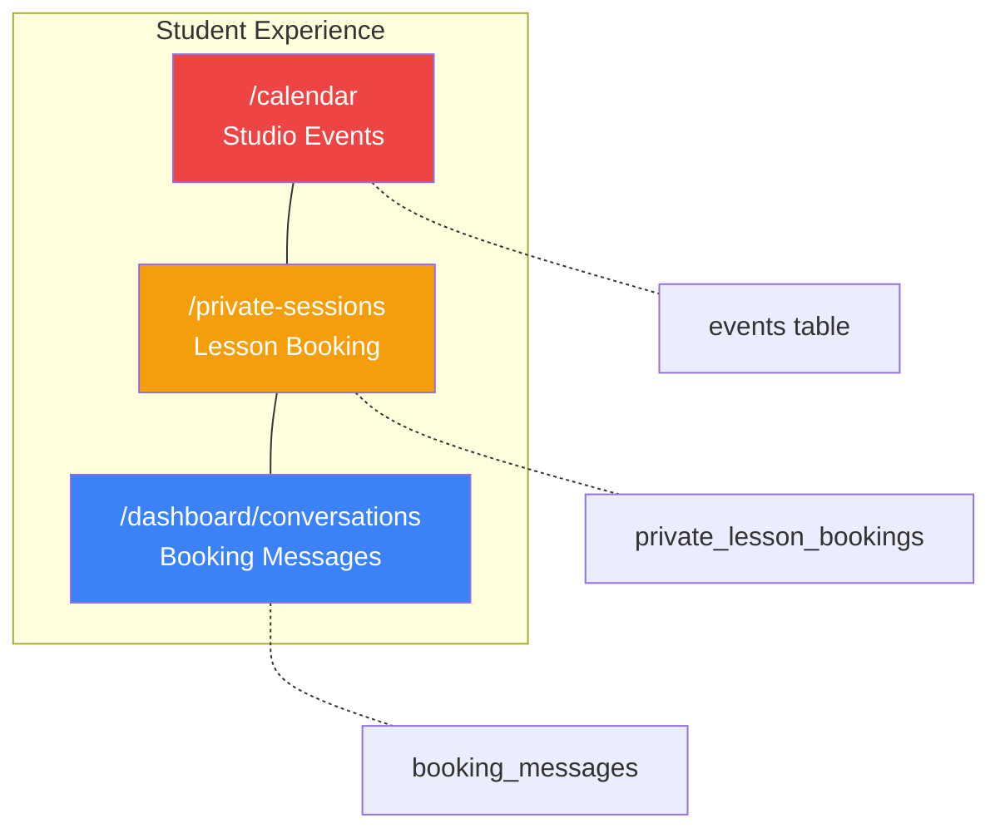

### Proposed State (Unified Authenticated View)

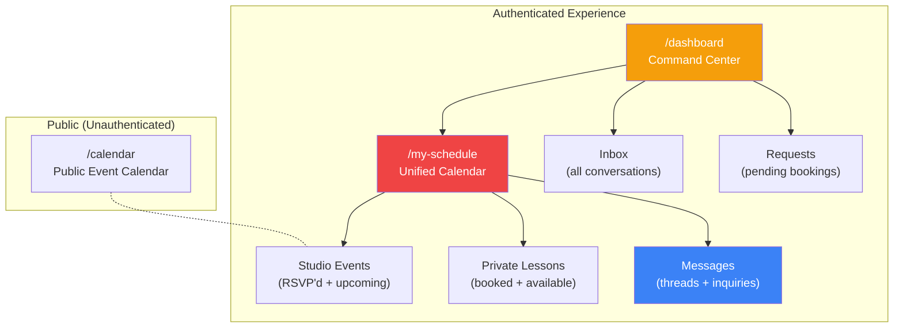

---

## 4. User Personas & Journeys

### 4.1 Student Journey: Discovery to Lesson

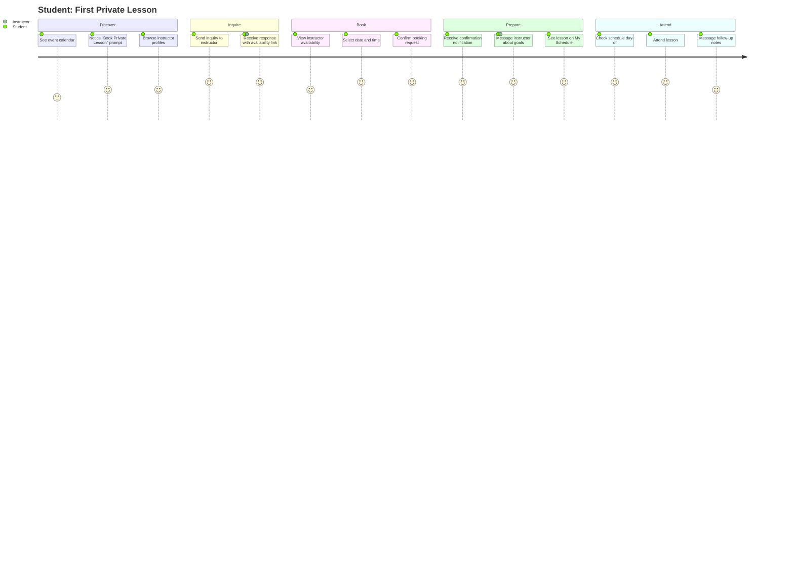

### 4.2 Instructor Journey: Daily Flow

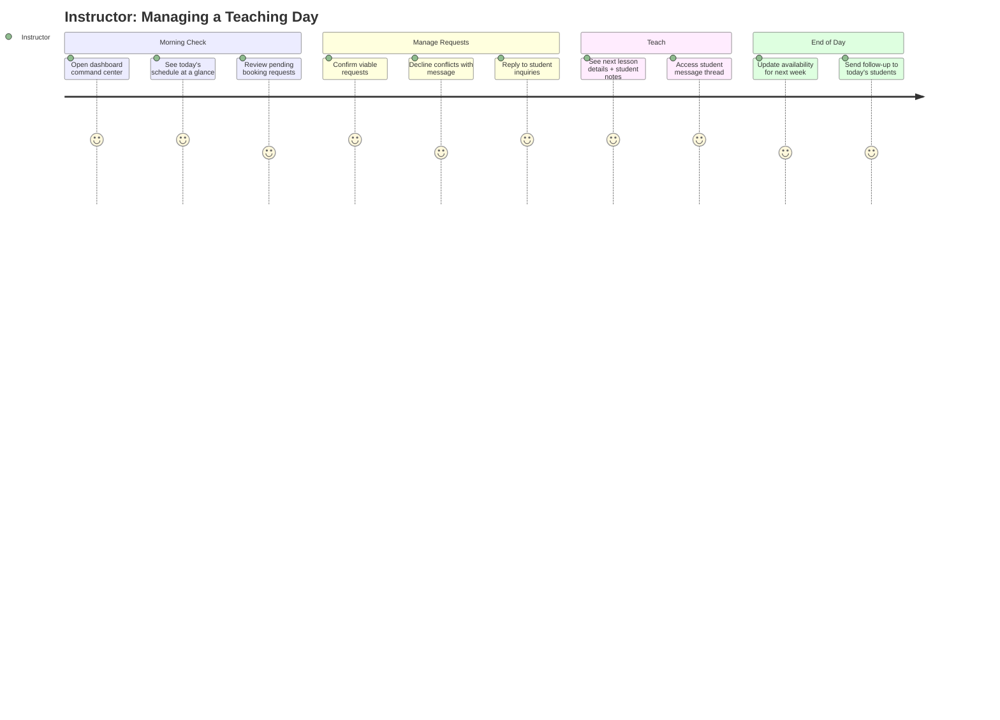

---

## 5. Feature: Unified Schedule View (`/my-schedule`)

### 5.1 Overview

A single calendar view for authenticated users showing all their commitments:
- Private lessons they've booked (as student) or are teaching (as instructor)
- Studio events they've RSVP'd to
- Available slots for booking (when viewing an instructor's availability)

### 5.2 Calendar Item Types

| Type | Color | Source | Who Sees It |
|------|-------|--------|-------------|
| Confirmed lesson (teaching) | Indigo (dark) | `private_lesson_bookings` | Instructor |
| Confirmed lesson (attending) | Indigo | `private_lesson_bookings` | Student |
| Pending lesson request | Yellow (dashed) | `private_lesson_bookings` | Both parties |
| RSVP'd event | (preserves event type color) | `event_rsvps` | The RSVP'd member |
| Available slot (browse mode) | Green (dashed) | `instructor_availability` | Student browsing |

> **Design decision:** Original draft used red/blue for lessons but this conflicts with existing `EVENT_TYPE_COLORS` (red=Class, blue=private_lesson). Indigo was chosen for all bookings to create a distinct "1:1 lesson" visual category. Yellow (not amber) for pending avoids conflict with Workshop amber. See `docs/specs/features/unified-schedule.md` Section 3.3 for full rationale.

### 5.3 Views

- **Week view** (default) — Time grid showing all items for the current week
- **Day view** — Detailed single-day view with expanded item cards
- **Month view** — Overview with dot indicators and item counts
- **List view** — Chronological list, good for mobile

### 5.4 Interaction: Tapping a Calendar Item

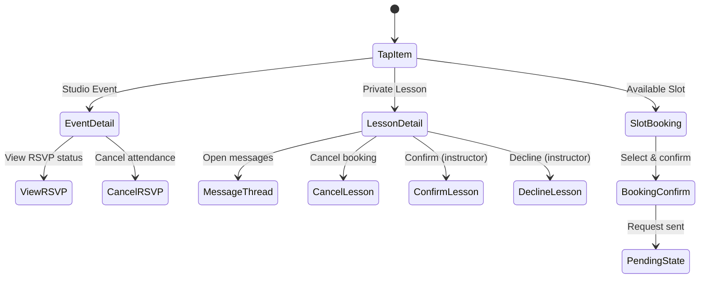

### 5.5 User Stories

- **US-1:** As a student, I can see all my upcoming lessons and RSVP'd events in one calendar so I can plan my week
- **US-2:** As an instructor, I can see my teaching schedule alongside studio events I'm involved in
- **US-3:** As a student, I can tap any calendar item to see details, message the instructor, or manage my booking
- **US-4:** As a student browsing for a lesson, I can overlay an instructor's availability on my schedule to find a good time
- **US-5:** As any user, I can switch between week/day/month/list views

### 5.6 Acceptance Criteria

- [ ] Authenticated users see `/my-schedule` as their primary calendar
- [ ] Calendar aggregates data from `private_lesson_bookings` and `event_rsvps`
- [ ] Items are color-coded by type (see table above)
- [ ] Tapping an item opens a detail sheet with relevant actions
- [ ] Week view is the default; all four views are functional
- [ ] Realtime updates when bookings change status or new messages arrive
- [ ] Mobile: swipe between days in day view; bottom sheet for details

---

## 6. Feature: Communication Layer

### 6.1 Overview

Replace the booking-only messaging with a broader communication system that supports three conversation types:

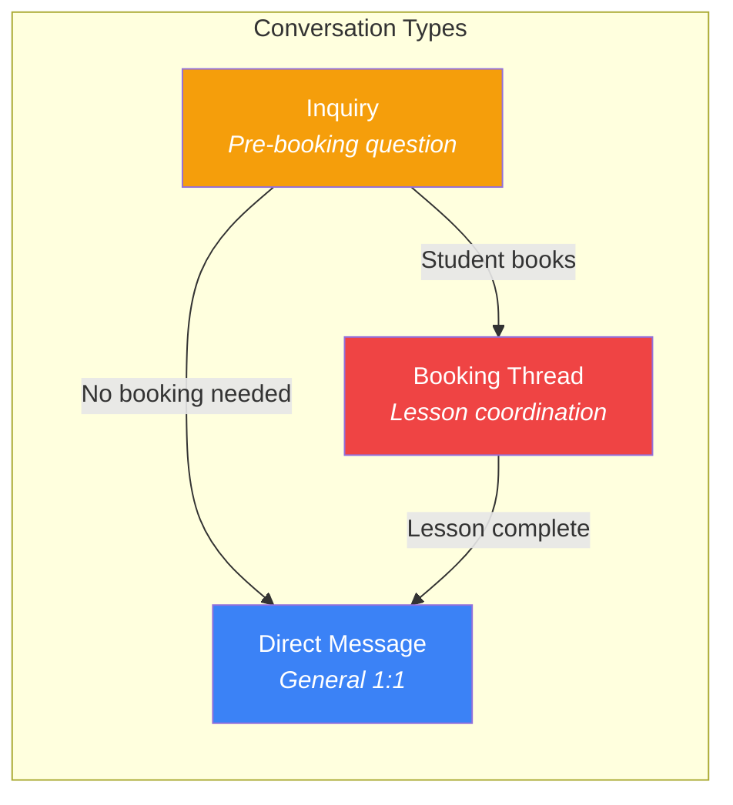

### 6.2 Conversation Types

| Type | Between | Trigger | Lifetime | Context |
|------|---------|---------|----------|---------|
| **Inquiry** | Student → Instructor | Student initiates from instructor profile or schedule | Until resolved (booking or answered) | "I'm interested in learning bachata basics" |
| **Booking Thread** | Student ↔ Instructor | Booking created | Tied to booking lifecycle | "For our Thursday lesson, can we focus on turns?" |
| **Direct Message** | Any two members | Either party initiates | Persistent | General conversation between members |

### 6.3 Inquiry → Booking Flow

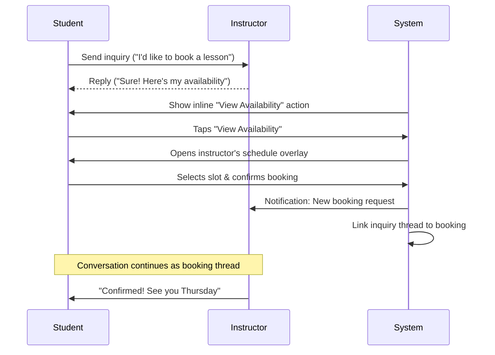

### 6.4 Unified Inbox

All conversation types appear in one inbox at `/dashboard/conversations`:

- **Unread first**, then sorted by most recent message
- Each conversation shows: participant name, avatar, last message preview, unread badge, conversation type tag
- Tapping opens the full thread with context (booking details shown inline if it's a booking thread)
- Inquiry threads show a "Book a Lesson" action button
- Booking threads show booking status badge and lesson details

### 6.5 User Stories

- **US-6:** As a student, I can message an instructor before committing to a booking so I can ask about their teaching style or availability
- **US-7:** As an instructor, I can see all my conversations (inquiries + booking threads + DMs) in one inbox
- **US-8:** As a student, I can transition from an inquiry into a booking without losing our conversation history
- **US-9:** As either party, I receive in-app notifications for new messages with a preview
- **US-10:** As an instructor, I can distinguish between inquiries and booking messages at a glance via type tags

### 6.6 Acceptance Criteria

- [ ] Students can send inquiries from instructor profiles or the schedule view
- [ ] Inquiries appear in the instructor's inbox with an "Inquiry" tag
- [ ] When a booking is created from an inquiry, the conversation thread carries over
- [ ] Inbox shows all three conversation types with visual distinction
- [ ] Unread indicators appear on the dashboard nav and inbox
- [ ] Messages update in realtime (< 3 second latency)
- [ ] 2000-character limit per message (consistent with current system)

---

## 7. Feature: Redesigned Booking Flow

### 7.1 Current Flow Problems

1. Student must navigate to `/private-sessions` — disconnected from rest of the app
2. No way to ask questions before committing
3. Instructor selection feels arbitrary without profiles or ratings
4. No visibility into "how busy is this instructor this week?"

### 7.2 Proposed Flow

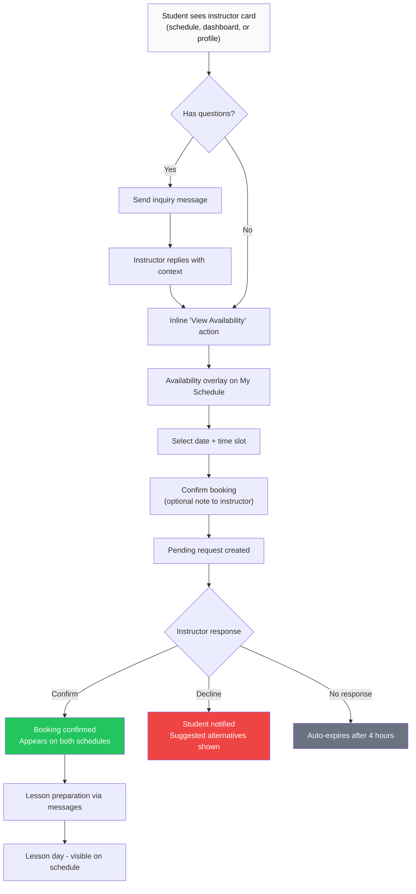

### 7.3 Entry Points for Booking

Students should be able to start a booking from multiple places:

| Entry Point | Context | Action |
|-------------|---------|--------|
| My Schedule (browse mode) | Viewing instructor availability overlay | Select slot directly |
| Instructor profile card | Dashboard or member directory | "Book a Lesson" or "Send Inquiry" |
| Conversation thread | Existing inquiry or DM with instructor | "View Availability" inline action |
| Dashboard prompt | Student hasn't booked before | "Try a Private Lesson" CTA |

### 7.4 Booking State Machine

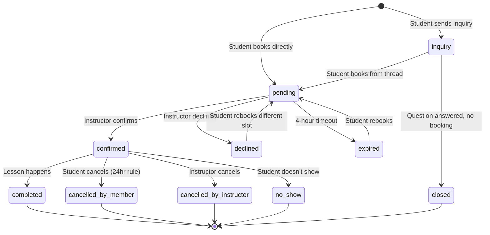

### 7.5 User Stories

- **US-11:** As a student, I can start a booking from my schedule, an instructor profile, or a conversation thread
- **US-12:** As a student, I can add an optional note when requesting a booking so the instructor knows what I want to work on
- **US-13:** As a student who gets declined, I see suggested alternative times so I can rebook easily
- **US-14:** As an instructor declining a request, I can include a message explaining why and suggest alternatives
- **US-15:** As a student, I see a "Try a Private Lesson" prompt on my dashboard if I've never booked one

### 7.6 Acceptance Criteria

- [ ] Booking can be initiated from at least 3 entry points (schedule, profile, conversation)
- [ ] Optional note field on booking confirmation dialog
- [ ] Declined bookings show instructor's message and suggest available alternatives
- [ ] First-time students see a discovery prompt on their dashboard
- [ ] Booking state transitions match the state machine above
- [ ] All state changes trigger realtime updates + in-app notification

---

## 8. Feature: Instructor Command Center

### 8.1 Overview

A redesigned instructor dashboard that consolidates everything into one view:

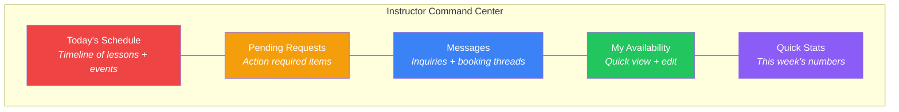

### 8.2 Dashboard Sections

**Today's Schedule (hero section)**
- Timeline view of today's confirmed lessons and events
- Each item shows: time, student name, lesson notes, message preview
- Tap to expand details or open message thread
- "No lessons today" state with link to manage availability

**Pending Requests (action cards)**
- Cards for each pending booking request
- Shows: student name, requested date/time, any note included
- Quick actions: Confirm, Decline (with message), View Conversation
- Badge count on dashboard nav

**Messages (recent threads)**
- Last 5 active conversations across all types
- Unread count badge
- "View All" link to full inbox

**My Availability (compact view)**
- This week's availability blocks shown as a mini weekly grid
- Quick "Edit Availability" link to full management view
- Highlight any overrides (blocked dates)

**Quick Stats**
- Lessons this week / this month
- Pending requests count
- Unread messages count

### 8.3 User Stories

- **US-16:** As an instructor, I can see my entire day (lessons + events) in one timeline when I open my dashboard
- **US-17:** As an instructor, I can confirm or decline booking requests directly from the dashboard without navigating away
- **US-18:** As an instructor, I can see and respond to messages (inquiries + booking threads) from the dashboard
- **US-19:** As an instructor, I can glance at my availability for the week and quickly edit it
- **US-20:** As an instructor, I see a count of pending requests and unread messages as badges

### 8.4 Acceptance Criteria

- [ ] Dashboard loads with today's timeline as the hero section
- [ ] Pending requests are actionable inline (confirm/decline without page navigation)
- [ ] Messages section shows the 5 most recent threads with unread indicators
- [ ] Availability mini-grid reflects current recurring schedule + overrides
- [ ] Stats update in realtime as bookings are confirmed/messages received
- [ ] Mobile: sections stack vertically; today's schedule remains the hero

---

## 9. Notification System

### 9.1 In-App Notification Triggers

| Event | Recipient | Notification |
|-------|-----------|-------------|
| New inquiry message | Instructor | "New inquiry from [Student]" |
| New booking request | Instructor | "[Student] requested a lesson on [Date]" |
| Booking confirmed | Student | "[Instructor] confirmed your [Date] lesson" |
| Booking declined | Student | "[Instructor] responded to your booking request" |
| Booking cancelled | Other party | "[Name] cancelled the [Date] lesson" |
| Booking expiring soon | Instructor | "Booking request from [Student] expires in 1 hour" |
| New message in thread | Other party | "[Name]: [message preview]" |

### 9.2 Notification Display

- Badge counts on dashboard nav items (Messages, Requests)
- Toast/banner for real-time events while user is active
- Glow animation on calendar items with unread messages (existing pattern)
- Unread dot on My Schedule nav item when any booking has unread messages

---

## 10. Implementation Phases

### Phase A: Unified Schedule Foundation
**Goal:** Replace fragmented calendars with `/my-schedule`
- Create unified calendar component that queries both `private_lesson_bookings` and `event_rsvps`
- Implement color-coded item types
- Support week/day/month/list views
- Tap-to-detail sheets for each item type
- Redirect authenticated users from `/private-sessions` and `/calendar` to `/my-schedule`

### Phase B: Communication Layer
**Goal:** Enable messaging beyond booking threads
- Add `conversations` and `conversation_messages` tables (or extend existing schema)
- Implement inquiry conversation type
- Build unified inbox at `/dashboard/conversations`
- Add "Send Inquiry" action to instructor profiles
- Conversation type tags and visual distinction

### Phase C: Booking Flow Redesign
**Goal:** Multiple entry points and smoother booking UX
- Add booking entry points (schedule overlay, profile card, conversation inline action)
- Implement optional booking notes
- Build decline-with-alternatives flow
- Add first-time student discovery prompt on dashboard
- Link inquiry → booking conversation thread continuity

### Phase D: Instructor Command Center
**Goal:** Single dashboard for instructor daily workflow
- Build today's timeline hero section
- Inline confirm/decline on pending request cards
- Recent messages section with unread badges
- Mini availability grid
- Quick stats counters

### Phase E: Notifications & Polish
**Goal:** Tie everything together with notifications
- Implement notification triggers (see table above)
- Badge counts on nav items
- Toast notifications for realtime events
- Mobile responsiveness pass across all new views
- Edge case handling and error states

---

## 11. Decisions (Resolved)

1. **Landing page:** Dashboard stays home. Today's schedule is the hero section; My Schedule is one tap away. Keeps the existing dashboard pattern.

2. **DM scope:** Student ↔ Instructor only for now. May expand to member-to-member in a later phase. Keeps messaging focused on the teaching relationship.

3. **Inquiry expiration:** Auto-close after 72 hours. Student receives notification: "Your inquiry wasn't answered. Try another instructor or book directly." Keeps instructor inboxes clean.

4. **Instructor profiles:** Enhanced cards are sufficient. Expand existing instructor cards with bio, specialties, and "Send Inquiry" / "View Availability" buttons. No dedicated profile pages needed.

5. **Owner view:** Yes — filterable master schedule showing all instructors combined. Owner can filter by instructor to spot conflicts, gaps, and overall studio utilization.

---

## 12. Owner Master Schedule

### 12.1 Overview

The owner gets a combined calendar view overlaying all instructor schedules, accessible from their dashboard.

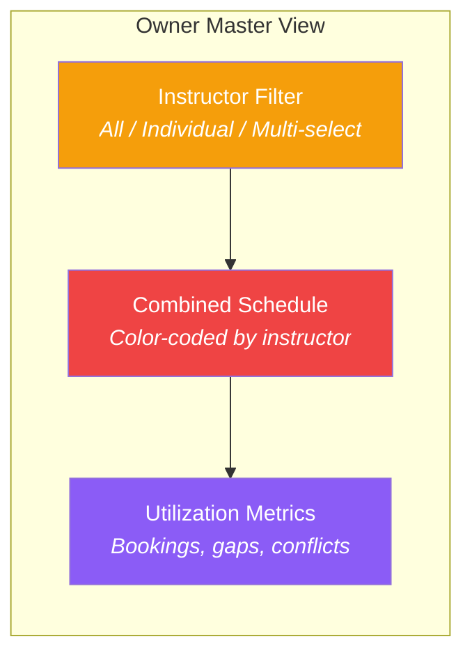

### 12.2 Features

- **Combined view:** All instructor schedules on one calendar, color-coded per instructor
- **Filter controls:** Toggle all instructors, select individual, or multi-select to compare
- **Conflict detection:** Highlight overlapping bookings or double-booked students
- **Gap visibility:** Show unbooked availability blocks to identify underutilized time
- **Quick stats:** Total lessons this week, utilization percentage, pending requests across all instructors

### 12.3 User Stories

- **US-21:** As the owner, I can see all instructor schedules on one calendar to understand studio utilization
- **US-22:** As the owner, I can filter by instructor to compare availability and booking patterns
- **US-23:** As the owner, I can spot scheduling conflicts or gaps at a glance

### 12.4 Acceptance Criteria

- [ ] Owner dashboard includes a "Studio Schedule" section or tab
- [ ] Calendar shows all instructors with distinct color coding
- [ ] Filter allows: all, single instructor, or multi-select
- [ ] Conflicts (overlapping confirmed bookings) are visually highlighted
- [ ] Unbooked availability gaps are visible in the combined view

---

*This PRD is intended to be handed to the do-work skill for implementation. Each phase should be executed as a separate design → implement → verify cycle.*
